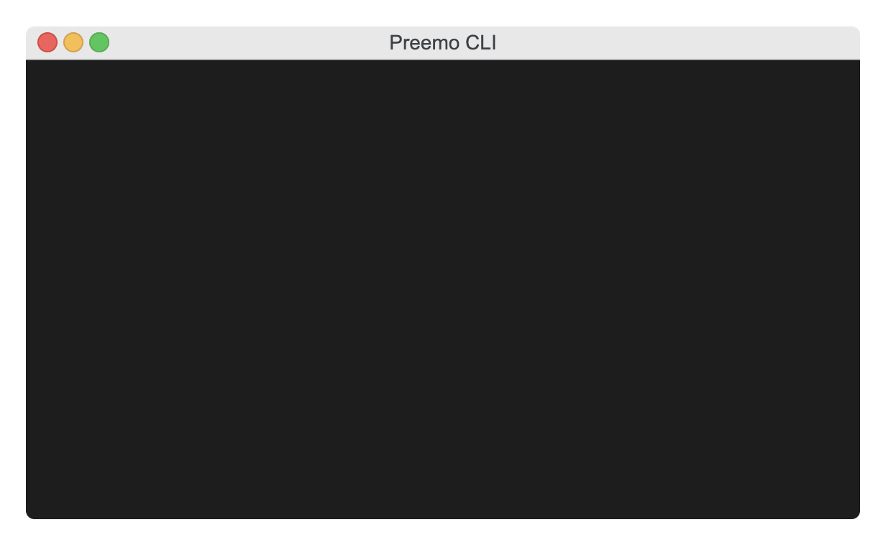

# gradient-sdk-typescript-example

Quick example of how to use Gradient API with Typescript.

Note, Node.js version must be >=18.

## Setup

The code relies on environment variables. They can be injected through `dotenv` by creating `.env` file in the current directory:

Visit the (Gradient docs)[https://docs.gradient.ai/] for more info on how to locate settings and use the SDK.

```
GRADIENT_API_KEY=...
GRADIENT_WORKSPACE_ID=...
```

## Usage

1. Clone this repo
2. Run `npm install`
3. Run `npm run list`

## Example




